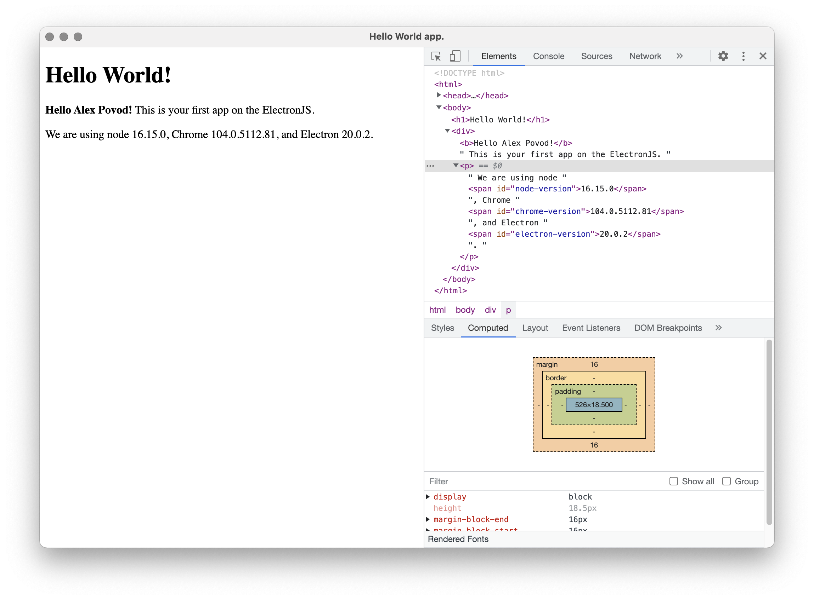

<a>
	 
<!-- 	<h1 align="Left"> </h1>  -->
</a>
# Hello World app on ElectronJS 

---
## Description

Simple electron application for demo purpose.

## Usage

1. Clone the repository by `$ git clone git@github.com:ialexpovod/ElectronJS-hello-world.git`.
2. Execute `$ npm install` to fetch dependencies.
3. Execute `$ npm start` or `npx electron` to start electron application.

## Screenshot mainwindow

## References

1. [Creating your First App](https://electronjs.org/docs/tutorial/first-app).
2. [electron/electron-quick-start](https://github.com/electron/electron-quick-start).
